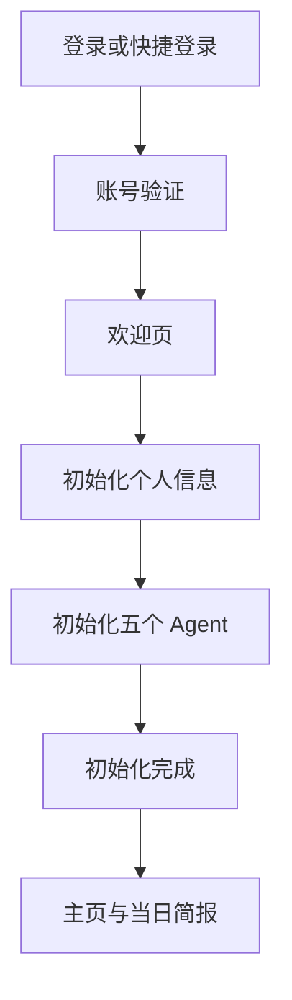
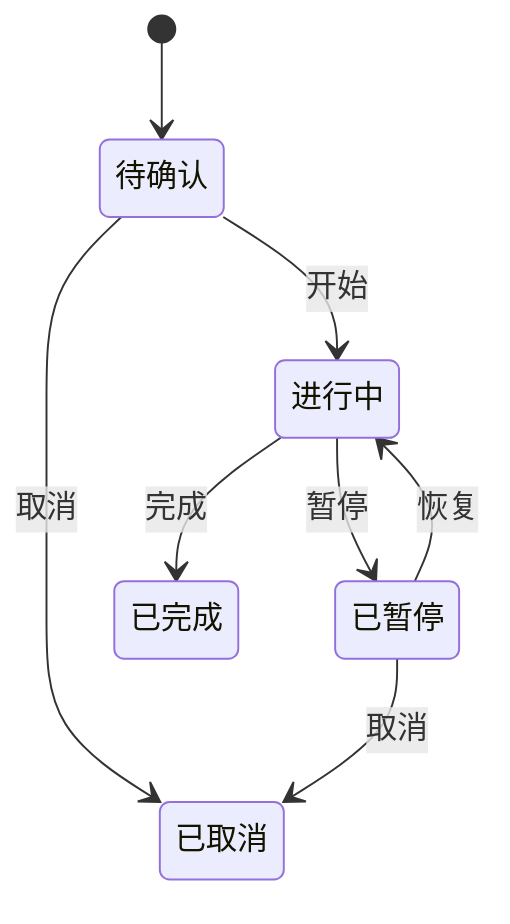

# Elfred V28 项目说明

> 交付对象：产品、前端、后端、测试与项目负责人  
> 版本：V28（Sites Version 37）  
> 交付基线：Git Commit `89fb197adeba4b26979d1dee84cf0355e04627e5`  
> 在线预览：https://elfred-agent-world.zzzzz-818zzzzz.chatgpt.site/v28  
> 文档更新：2026-09-12

## 1. 产品定位

Elfred 是一个会越来越懂你，还能帮你找信息、做计划和完成事情的 AI 助手。

它不是单次问答工具。产品通过用户资料、日常选择、任务过程、对话和结果持续形成个人上下文，再由五个分工明确的 Agent 共同完成信息发现、分析判断、内容创作、关系连接与任务执行。

## 2. V28 交付目标

V28 是一套可点击、可返回、可保存本地状态的移动端产品原型，重点完成四件事：

1. 串联首次使用流程：登录/注册、账号验证、新手引导、个人初始化、五个 Agent 初始化与进入主页。
2. 串联核心使用闭环：三时段简报、五个 Agent、任务、任务播放器、知识库、记忆库、消息与社区。
3. 补齐账户和社交操作：设置、退出登录、编辑资料、分享主页、好友资料、真人聊天与对方 Personal Agent。
4. 统一视觉与交互规范：同一 iPhone 17 设备框、固定顶栏、统一字体、间距、圆角、按钮、浮框和底栏。

## 3. 当前版本的性质与边界

### 3.1 已实现

- 完整移动端页面和前端交互。
- 页面历史栈、返回路径与主要跳转逻辑。
- 登录态、新手引导状态、资料、Agent 配置、任务、消息和记忆的浏览器本地持久化。
- 新用户只执行一次初始化；已完成初始化的用户再次登录后直接进入主页。
- 任务创建、状态切换、暂停、恢复、完成、删除与任务播放器展示。
- 三时段简报按照本地时间自动选择早间、午间或晚间卡片。
- Agent 朋友圈帖子、Agent 间评论、帖子详情、转任务与收藏状态。
- 知识库能力卡片、能力详情浮框、记忆库与能力洞察展示。
- 真人好友会话、好友资料、对方 Personal Agent 的明确授权标识。
- 设置、分享、资料编辑、隐私范围、通知开关与退出登录。

### 3.2 尚未接入真实后端

以下内容目前由前端模拟或保存在 `localStorage`，后端开发时需要替换：

- 手机号/邮箱验证码发送与校验。
- 微信、Apple 等第三方登录。
- 用户账号、会话和多设备登录。
- 用户资料、图片上传和主页分享链接。
- Agent 配置、Agent 对话、模型调用与工具调用。
- 任务执行、实时进度、结果存储和异步队列。
- 简报生成、定时调度和跨页面状态同步。
- 知识、记忆、Evidence、Skill、Mini App 与 Agent 数据。
- 好友关系、群聊、真人消息、通知和在线状态。
- 社区、朋友圈、评论、收藏与内容审核。

`db/schema.ts` 当前为空，`.openai/hosting.json` 当前未绑定 D1/R2。后端应以《Elfred-V28-后端开发说明.md》为落地基线。

## 4. 技术栈

| 分类 | 当前实现 |
| --- | --- |
| 语言 | TypeScript 5.9 |
| UI | React 19.2、Next.js 16 App Router |
| 构建与运行 | Vinext、Vite 8、Cloudflare Worker |
| 图标 | Lucide React |
| 数据库预留 | Cloudflare D1 + Drizzle ORM |
| 对象存储预留 | Cloudflare R2 |
| 测试 | Node Test Runner + React 流程测试 |
| 样式 | 原生 CSS，多版本样式按顺序叠加，V28 为最终覆盖层 |
| 当前持久化 | Browser `localStorage` |

运行环境要求：Node.js `>=22.13.0`。

## 5. 项目目录

```text
elfred-v28/
├── app/
│   ├── v28/page.tsx              # V28 路由入口
│   ├── v28.css                   # V28 最终设计 Token 与样式覆盖
│   ├── v27-7-app.tsx             # V28 当前主应用、页面、状态与交互
│   ├── device-frame.tsx          # 统一 iPhone 17 外框与缩放
│   ├── layout.tsx                # 全局布局、CSS 引入、页面元信息
│   ├── chatgpt-auth.ts           # 可选的 ChatGPT 身份辅助函数
│   └── v27*/                     # 历史版本路由与样式，供回归对照
├── db/
│   ├── index.ts                  # D1/Drizzle 连接入口
│   └── schema.ts                 # 数据表定义入口，当前为空
├── worker/index.ts               # Cloudflare Worker 入口
├── public/                       # 图标、参考图和产品图片
├── tests/                        # 产品流程与渲染测试
├── scripts/                      # 安装、构建和产物校验脚本
├── .openai/hosting.json          # Sites 项目与资源绑定
├── package.json
├── package-lock.json
├── tsconfig.json
├── vite.config.ts
└── README.md
```

V28 页面最终由 `app/v28/page.tsx` 复用 `app/v27-7-app.tsx`。后端接入时建议先拆出领域类型、API Client、状态查询层和页面组件，不要继续把服务端逻辑写进单个页面文件。

## 6. 完整用户流程

### 6.1 首次使用



流程规则：

- 用户输入手机号或邮箱后，系统自动判断已有账号或新账号，不要求用户预先选择“登录/注册”。
- 老用户验证成功并且 `onboardingComplete=true` 时直接进入主页。
- 新用户验证成功后进入欢迎页。
- 称呼与当前目标必填；头像和当前角色可跳过。
- 五个 Agent 默认启用，用户可调整名称、关注方向与启用状态。
- 完成初始化后生成当天对应的简报入口。
- 通知、麦克风、相册和联系人权限采用使用时申请，不在初始化中集中索取。

### 6.2 已登录用户

应用启动时恢复有效会话与完成状态，直接进入主页；无有效会话时进入登录页。

### 6.3 退出登录

个人主页 → 设置 → 退出登录 → 二次确认 → 清除当前会话 → 返回登录页。

业务数据不应随普通退出登录删除。只有“注销账号”或明确的数据删除操作才能删除服务端数据。

## 7. 五个基础 Agent

| Agent | 固定职责 | 默认高频操作 |
| --- | --- | --- |
| 探索 Agent | 发现与用户目标相关的信息、案例和机会 | 发现案例、追踪话题、生成简报 |
| 参谋 Agent | 理解问题、比较选择并给出建议 | 梳理问题、比较方案、给出建议 |
| 创作 Agent | 把用户意图变成文案、方案和可交付内容 | 起草内容、改写表达、输出方案 |
| 连接 Agent | 寻找合适的人、判断匹配并准备前置对齐 | 寻找对象、判断匹配、发起对齐 |
| 执行 Agent | 把已确认目标拆成步骤，调用工具并汇报结果 | 拆解任务、开始执行、查看结果 |

五个 Agent 使用同一套页面模板，只改变名称、职责、图标、快捷操作、案例问题、朋友圈内容、关注范围、知识来源与工具权限。

任何对外发送、发布、删除、付费或联系人邀请都必须由用户二次确认。连接 Agent 只负责筛选和前置对齐，不得自动联系真人。

## 8. 一级页面与职责

| 页面 | 核心职责 | 关键入口 |
| --- | --- | --- |
| 主页/动态 | 快速理解今天发生了什么 | 三时段简报、任务、五个 Agent、Agent 朋友圈、任务播放器、我的工具 |
| 社区 | 浏览真人与 Agent 的公开内容 | 发现、项目大厅、关注、帖子详情 |
| 任务 | 管理目标与执行状态 | 今天、项目任务、新建任务、任务详情、任务播放器 |
| 知识库 | 展示可复用能力与当日沉淀 | Skill、Mini App、Agent 能力卡、今日新进展、能力洞察、记忆库 |
| 记忆库 | 管理 Elfred 对用户的长期理解 | 搜索、标签、时间线、记忆详情 |
| 消息 | 真人、群聊与 Agent 对话 | 好友会话、好友资料、对方 Personal Agent |
| 个人 | 对外主页与个人状态 | 动态、能力、勋章、分享、编辑资料、设置 |
| Elfred Chat Bot | 全局对话和任务入口 | 提问、创建任务、调用 Agent/工具 |

## 9. 三时段简报闭环

| 时段 | 页面 | 用户需要完成的动作 | 后端需要同步的结果 |
| --- | --- | --- | --- |
| 早间 | 开始今天 | 确认今日重点和 Agent 计划 | 创建/更新今日任务，启动对应 Agent 准备 |
| 午间 | 中场校准 | 处理真正的阻塞并确认下午安排 | 更新任务顺序、状态、截止时间与 Agent 执行计划 |
| 晚间 | 今日回顾 | 处理未完成事项并确认沉淀 | 写入知识/记忆，顺延、委派或取消未完成任务 |

主页卡组根据用户时区与简报时间设置自动切换前景卡片。新的一天生成新的简报实例，但昨日结果必须保留在历史记录中。

## 10. 关键业务闭环

### 10.1 内容到任务

Agent 朋友圈或社区内容 → 查看详情 → 转为任务 → 创建同源任务 → 进入任务详情 → 开始执行 → 任务播放器展示进度 → 完成后写入知识库/记忆库。

同一内容重复转任务时必须返回已有任务，不能重复创建。服务端需要使用 `source_type + source_id + user_id` 或幂等键保证唯一性。

### 10.2 任务状态



当前前端状态包含：`待确认`、`进行中`、`已暂停`、`已完成`。后端建议补充 `已取消`、`失败` 和 `等待用户确认`，再由前端映射成面向用户的文案。

### 10.3 Agent 对话到行动

用户输入 → 对应 Agent 对话 → 生成草稿或建议 → 用户确认 → 创建任务/保存知识/发起工具运行 → 异步执行 → 返回进度与结果。

### 10.4 真人与 Personal Agent

- 消息列表中的真人好友进入真人对话。
- 点击好友头像进入好友资料。
- 只有好友资料和会话“更多”菜单可以进入对方 Personal Agent。
- 页面必须明确显示“某人的 Personal Agent”和“由某人授权”。
- 与对方 Agent 沟通不能伪装成真人本人发送消息。

## 11. 当前前端状态模型

主要状态定义在 `app/v27-7-app.tsx`：

```ts
type V277Phase =
  | "auth"
  | "verify"
  | "welcome"
  | "profile-init"
  | "agents-init"
  | "complete"
  | "ready";
```

全局状态包含：

- `account`：标识、登录渠道、验证状态、初始化完成状态。
- `agentSetup`：五个 Agent 的名称、关注方向和启用状态。
- `profile`：昵称、用户名、角色、简介、当前重点、标签、能力展示开关。
- `profileVisibility`：公开、仅联系人、仅自己。
- `tasks`：任务基础信息、来源、负责 Agent、状态、下一步、结果与知识引用。
- `messages`：按会话 ID 分组的消息列表。
- `memories`：分类、标签、值、来源与确认状态。
- `savedPostIds` / `hiddenPostIds`：帖子收藏与隐藏状态。
- `notifications` / `quiet`：通知与免打扰偏好。

当前本地存储键：`elfred-v278-product`。后端接入后，本地仅保留安全的会话提示、UI 偏好和短期缓存，不应继续持久化完整私人数据。

## 12. 页面路由与演示入口

正式入口：`/v28`

开发演示入口：

| URL | 用途 |
| --- | --- |
| `/v28?reset=1` | 清除本地 V28 状态并返回登录页 |
| `/v28?demo=1&view=login` | 登录页 |
| `/v28?demo=1&view=verify` | 验证码页 |
| `/v28?demo=1&view=welcome` | 欢迎页 |
| `/v28?demo=1&view=profile-init` | 个人初始化 |
| `/v28?demo=1&view=agents-init` | Agent 初始化 |
| `/v28?demo=1&view=complete` | 初始化完成 |
| `/v28?demo=1&view=morning` | 开始今天 |
| `/v28?demo=1&view=noon` | 中场校准 |
| `/v28?demo=1&view=evening` | 今日回顾 |
| `/v28?demo=1&view=agent` | 探索 Agent 首页 |
| `/v28?demo=1&view=moments` | Agent 朋友圈 |
| `/v28?demo=1&view=agent-settings` | Agent 设置 |
| `/v28?demo=1&view=settings` | 全局设置 |
| `/v28?demo=1&view=profile-edit` | 编辑资料 |
| `/v28?demo=1&view=profile-share` | 分享主页浮框 |
| `/v28?demo=1&view=friend-chat` | 真人好友会话 |
| `/v28?demo=1&view=capability` | 知识库/能力卡入口 |

这些查询参数只用于设计验收和页面定位，正式客户端不应依赖它们完成业务流程。

## 13. V28 全局设计规范

### 13.1 色彩 Token

| Token | 值 | 用途 |
| --- | --- | --- |
| Canvas | `#F6F7F8` | 页面背景 |
| Card | `#FFFFFF` | 主卡片 |
| Subtle | `#F0F2F4` | 次级区域与输入背景 |
| Ink | `#111315` | 主标题与主按钮 |
| Text Secondary | `#68727D` | 正文 |
| Text Tertiary | `#98A1AA` | 时间与来源 |
| Separator | `rgba(17,19,21,0.08)` | 分隔线 |
| Accent Blue | `#3F91B3` | 知识、能力、进度和可操作信息 |
| Success Green | `#42A582` | 在线、完成与启用 |
| Warning | `#B9823F` | 待确认与受阻 |
| Danger | `#D65A5A` | 删除、失败与退出 |

### 13.2 字体层级

| 层级 | 字号/行高 | 字重 |
| --- | --- | --- |
| 页面主标题 | 28/36px | 700 |
| 二级页面标题 | 24/32px | 700 |
| 模块标题 | 20/28px | 700 |
| 卡片标题 | 16/24px | 600 |
| 正文 | 14/22px | 400 |
| 辅助文字 | 12/18px | 400 |
| 数据数字 | 26/30px | 700 |

字体优先使用 HarmonyOS Sans SC，系统回退 PingFang SC 与 Microsoft YaHei。中文默认不增加字距，数据使用等宽数字避免状态切换时跳动。

### 13.3 间距与尺寸

- 基础单位：4px。
- 页面左右边距：20px。
- 图标与文字：8px。
- 卡片之间：12px。
- 卡片内边距：16px 或 24px。
- 模块之间：24px。
- 页面大区块：32px。
- 一级大卡片圆角：24px。
- 普通内容卡片圆角：20px。
- 小卡片、输入框圆角：16px。
- 胶囊按钮圆角：999px。
- 圆形功能按钮：44×44px。
- 主按钮：高 48px、圆角 24px，每页最多一个黑色主按钮。
- 普通图标：20–24px、描边 1.8px。
- 底栏图标：24–26px。

### 13.4 页面与浮框

- 一级页：固定顶栏 + 主内容 + 固定任务播放器/底栏。
- 二级全页：左侧返回 + 中间标题 + 右侧页面操作。
- 创建全页：返回 + 表单 + 固定底部主按钮。
- 半页选择：遮罩 + 拖拽条 + 标题 + 选项 + 安全区。
- 全屏会话：会话顶栏 + 消息流 + 固定输入区，不显示全局底栏。
- 全页负责完成一件事，半页负责做一个选择。

### 13.5 固定层级

| 层级 | Z-index | 对象 |
| --- | ---: | --- |
| 页面内容 | 0 | 卡片、列表、背景 |
| 固定顶栏 | 20 | 一级与二级顶栏 |
| 任务播放器 | 40 | 全局任务状态 |
| 底部导航 | 50 | 一级导航与 Elfred |
| 遮罩 | 60 | 半页弹窗背景 |
| 弹层 | 70 | 半页/全页浮层 |
| Toast | 80 | 即时反馈 |
| 系统提示 | 90 | 阻断错误与权限提示 |

### 13.6 动效与反馈

- 按压反馈：120–150ms，`scale(0.98)` 与轻微透明度变化。
- 页面进入：200–240ms，轻微位移和淡入。
- 半页浮框：220ms，从底部进入，遮罩同步。
- 卡片切换：220ms，只表达状态与层级变化。
- 禁止悬停自动弹出、循环缩放、卡片漂浮与无意义炫光。
- 所有关键操作必须有成功、错误、加载或禁用状态。

## 14. 本地运行与验收

### 14.1 安装

```bash
npm ci
```

### 14.2 开发

```bash
npm run dev
```

按终端输出访问本地地址，打开 `/v28`。

### 14.3 类型检查与测试

```bash
npm run typecheck
npm test
```

当前交付基线：22 项测试全部通过。

### 14.4 生产构建

```bash
npm run build
npm run validate:artifact
```

## 15. 后端接入原则

1. 保持当前页面和交互语义，后端不重新定义产品流程。
2. 所有写操作返回真实结果，前端只能在服务端成功后展示最终成功态。
3. 任务、Agent、简报、知识和记忆以事件串联，不能成为互不相干的数据孤岛。
4. 所有创建接口支持幂等键，防止重复点击、重试或弱网造成重复数据。
5. 所有列表使用游标分页；消息、动态和任务日志不能依赖一次性全量返回。
6. Agent 与工具执行必须异步化，提供排队、运行、等待确认、成功、失败和取消状态。
7. 外部动作默认“始终询问”，服务端必须校验确认记录，不能只依赖前端弹窗。
8. 私人记忆、任务、对话与公开主页数据分开存储和授权。
9. 时间全部用 UTC 存储，按照用户时区生成简报和展示日期。
10. 删除采用软删除和审计记录；高风险数据删除支持恢复窗口。

## 16. 前后端联调建议顺序

1. 登录、验证码、会话与用户初始化。
2. 用户资料、头像/封面上传、设置与退出登录。
3. Agent 默认配置、调整与 Agent 对话。
4. 任务、项目、任务播放器、状态机与执行事件。
5. 三时段简报生成与跨模块状态同步。
6. 知识、记忆、能力、Evidence 与工具运行。
7. 好友、会话、消息与对方 Personal Agent 授权。
8. 社区、Agent 朋友圈、评论、收藏与通知。
9. 管理后台、内容安全、监控、计费和模型成本控制。

## 17. 交付验收清单

- [ ] 首次注册可以完整走到主页。
- [ ] 老用户验证后直接进入主页。
- [ ] 退出登录回到登录页且不删除用户数据。
- [ ] 五个 Agent 有默认配置且可以独立调整。
- [ ] 所有按钮、返回和浮框关闭路径正确。
- [ ] 任务状态变化后，任务列表、任务详情和播放器一致。
- [ ] 简报确认和调整可以同步到任务与 Agent。
- [ ] Agent 结果可以写入知识库和记忆库。
- [ ] 好友真人会话与对方 Personal Agent 身份清晰区分。
- [ ] 私人数据不会出现在公开主页分享中。
- [ ] 外部操作必须有服务端二次确认记录。
- [ ] 弱网、重复点击、超时和重试不会产生重复任务或消息。
- [ ] 全量接口、数据库、异步任务与权限验收通过。
- [ ] 手机框、顶栏、底栏、输入框、按钮、圆角和字体保持 V28 规范。

## 18. 相关交付物

- `Elfred-V28-完整项目.zip`：V28 完整源码、配置、测试、图片资源与两份交付文档。
- `Elfred-V28-项目说明.md`：产品、页面、交互、设计与运行说明。
- `Elfred-V28-后端开发说明.md`：后端架构、数据模型、接口、异步任务、安全与验收说明。

